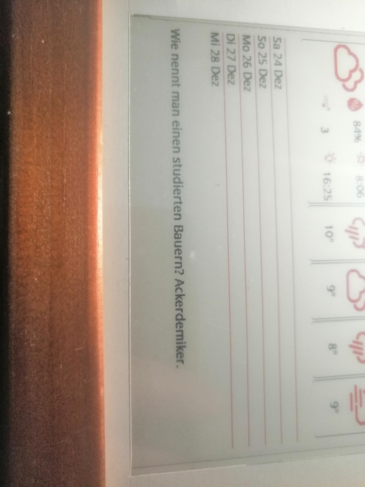

# Inkycal Witzapi_de

This is a third-party modules for the [Inkycal project](https://github.com/aceisace/Inky-Calendar)

## Screenshot



## Description

It shows a joke from the witzapi.de API.

It currently requires the 'category' parameter to know which category of jokes you want.
You can specify 'all' to get a joke from any category.

To see the available categories, check [https://witzapi.de/api/category/](https://witzapi.de/api/category/).

# Installation instructions
How to install the module.

1) Navigate to the modules directory
`cd Inkycal/inkycal/modules`

2) Download the third-party module:
```bash
# The URL is the rawfile url. e.g. open mymodule.py, then click on [raw] to see the rawfile-url
wget https://raw.githubusercontent.com/aceisace/inkycal_template/master/mymodule.py
```

3) Register this module in Inkycal
```python3
# In python, type the following commands:
from inkycal import Inkycal
Inkycal.add_module('/full/path/to/your/module.py')
# If everything went well, you should see a printed message without red lines.
```
# Thanks

I want to thank aceisace for creating Inkycal. Also this module is mostly a copy of his [jokes module](https://github.com/aceisace/Inkycal/blob/main/inkycal/modules/inkycal_jokes.py).

I also want to thank [https://witzapi.de](https://witzapi.de) for providing the API.
